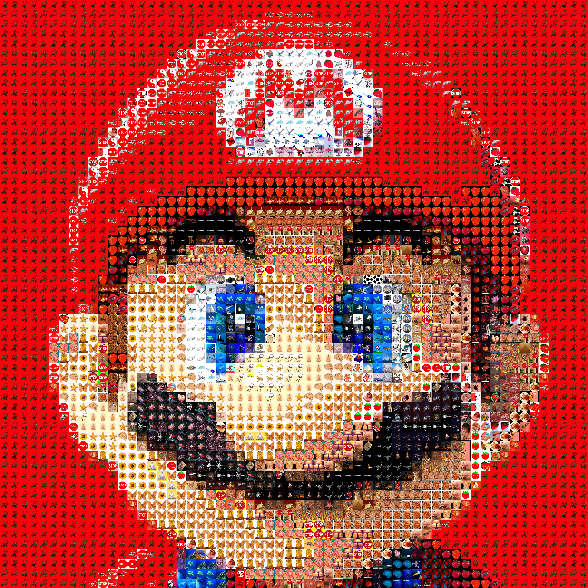

# Pictacular 

Pictacular is an efficient online mosaic maker. 
Using a 10,000 image dataset, it rapidly synthesizes images to recreate your original submission. 

## Algorithm : Most Naive
The naive solution to this problem would be to take the given image (G) and divide it up into N squares. For each of the N squares, we would find the average color by adding up all the color values and dividing it by the number of pixels. For each of the N squares we would go through each of the M images in our database, compute the average color, requiring a calculation for P pixels. We would compare the average color of G to each of the average colors and find the closest, requiring M comparisons. Finally, we would replace each square with the new image.

The time complexity for this naive algorithm would be O(NxMxP). N would likely be around 3000, M is around 10,000 and P would be around 1,000,000. This means that to produce one image would take *30 trillion calculations*. While this solutions is simple it is far too slow and we clearly need a different better approach.

## Algorithm: Less Naive (1 Million Times Faster than Naive)

One simple way to make it faster is to cache the average color of each pixel. This removes having to do 1 million calculations for each photo each time. This means we only have to do O(N*P) or 30 million calculations. However, this is still too slow. 

## Algorithm: Optimized (7,000 Times Faster than Less Naive & 5 Billion Times Faster than Naive)
I devised a more clever algorithm to solve this problem. First, we create a finite RGB color vector space. This is just a fancy term for a color cube. (To see what this looks like, check out this picture: https://i.stack.imgur.com/hSPKq.gif ).
This color cube is basically a 3D spectrum that contains all possible colors. We break this cube into subcubes by slicing the cube into 16 layers, on each of the 3 dimensions. As a result we get 16^3 or 4096 subcubes. Each subcube represents one area of color, or a color zone. For each color zone, we map it to the closest image. Again, instead of calculating the average color of every image over and over, we simply calculate it once and cache the results. Also, instead of finding average color by using every pixel we can use every 15th column and every 15th row. To map each color zone to the nearest image, we compare it to all of the average colors. The time complexity to create this mapping is O(S*M) where S is the number of subcubes and M is the number of images in the database. This is around 4000x10,000 or 40 million calculations. This seems to be no better than our Less Naive solution; when I ran this on my computer it took several minutes to finish computing! 

*But!*

But we don't need to calculate this mapping everytime! We only need to calculate it once and then we can cache it and use it later. Using our mapping, we have a much more efficient way to create a mosaic. We break our image into N cubes and find the average color of each cube. Once we have the average color, we can find what color zone it belongs to and, in constant time, get the image from the mapping. The only thing that now takes proportionally increasing time is averaging colors, but we have made that even faster by selecting only every 15th row and every 15th pixel. 

Thus we have now acheived *O(W/k^2) time*, where W is the number of pixels of the given picture and k is the number of rows and columns we skip between picking each pixel. We have gone from 30 million calculations to only around 4 thousand calculations. Thus we have made our program over *5 thousand times faster*.

## Example

*Original*

*Output*

